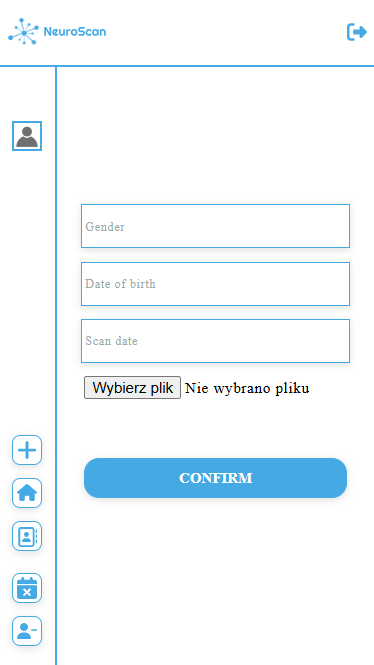

# NeuroScan

> AI-Powered Radiology System

## Table of contents

* [About website](#about-website)
* [Technologies used](#technologies-used)
* [Features](#features)
* [Roles](#roles)
* [Database](#database)
* [Launch](#launch)
* [Screenshots](#screenshots)

## About website

This application is a comprehensive application designed to streamline radiology workflows through the use of artificial intelligence. The system allows radiologists to upload MRI scans, which are then analyzed by an artificial intelligence model to help diagnose conditions such as brain tumors.

## Technologies used

### Front-end

- React
- HTML
- CSS

### Back-end

- Django

### Database

- PostgreSQL

### Other

- TensorFlow
- PgAdmin
- Docker
- Git

## Features

These are the most important features:

- The application implements a tiered system of roles: administrator and radiologist. Each role possesses progressively advanced permissions, ensuring secure and appropriate access to different parts of the system.
- Radiologists can upload, view, and manage MRI cases with detailed patient information. The system supports the secure handling and storage of medical images and patient data.
- Automatic analysis of MRI scans using a pre-trained AI model, providing diagnostic assistance to radiologists. The AI model helps in identifying conditions such as tumors, enhancing diagnostic accuracy and efficiency.
- Secure session-based login management using JWT Authentication, ensuring that user sessions are properly authenticated and managed throughout their interaction with the application.
- Offers a REST API for seamless interaction with the system, enabling standard HTTP methods for efficient data management and integration with other radiological systems.

## Roles

The table below illustrates permissions associated with each role:

| Role | Browsing scans | Adding a scan | Identifying the disease | Removing a scan | Removing a user
| ------------- | ------------- | ------------- | ------------- | ------------- | ------------- |
| Admin  | X | X | X | X | X |
| Radiologist  | X | X | X | | |

## Database structure

### ERD

## Launch

### Web application

To access the web application, follow these steps:

1. Clone the project.
2. Run `docker-compose up` in main directory.
3. Wait for the creation of the necessary containers.

The application has been launched! You can enter it by typing `localhost:5173` into your browser's address bar. You can use the application as a user by creating your own account for this purpose. If you wish to utilize administrator privileges, log in to the application using the following credentials:

| Username | Password |
| ------------- | ------------- |
| admin | admin |

### Database

To access the database, follow these steps:

1. Go to location `http://localhost:5050`
2. Log in using administrator credentials:
   
  | Email | Password |
  | ------------- | ------------- |
  | admin@neuroscan.com | admin |

3. Register the database server using internal credentials:
   
  | Host | Port | Maintenance database | Username | Password |
  | ------------- | ------------- | ------------- | ------------- | ------------- |
  | db | 5432 | postgres | postgres | postgres |

### REST API

To access the debug version of the REST API, follow these steps:

1. Go to location `http://localhost:8000`
2. With the list of available API functions, you can run your own tests using Postman.

### Swagger

To access swagger documentation go to `http://localhost:8000/swagger/`

## Screenshots - Web

 
 
 
 

## Screenshots - Mobile

